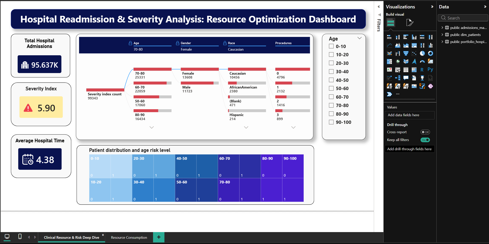
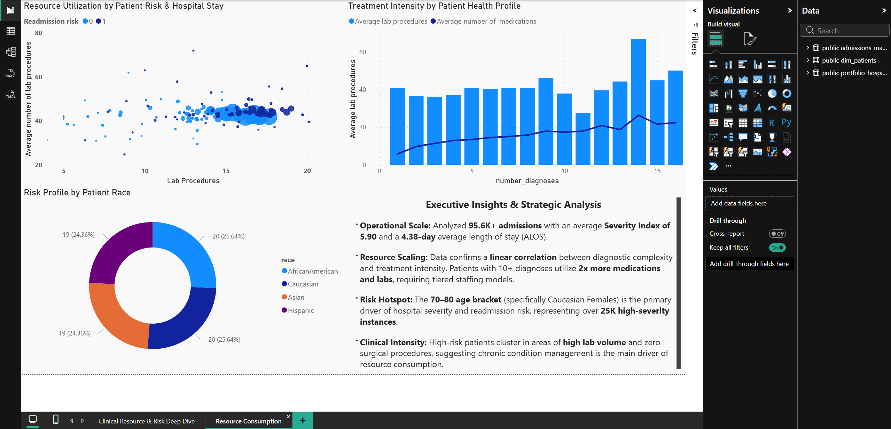
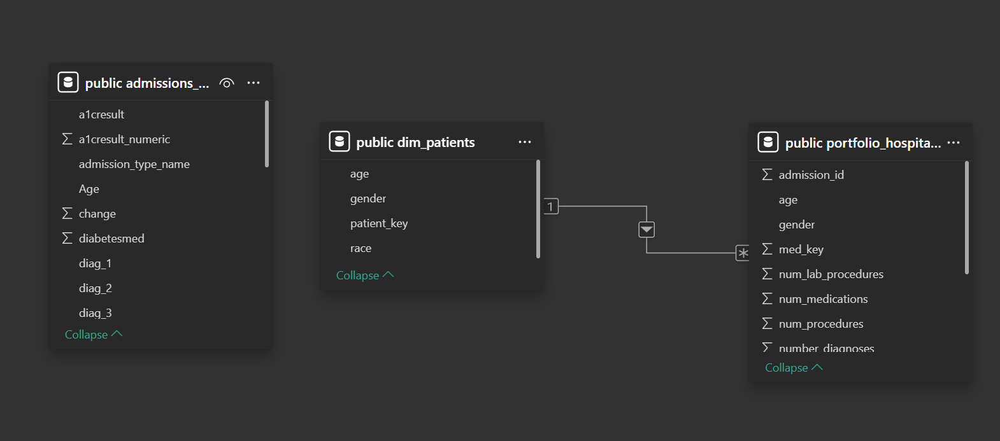

🏥 Hospital Clinical Resource & Readmission Analysis

📌 Overview

This project is an end-to-end healthcare analytics pipeline designed to identify the drivers of patient readmission risk and hospital resource utilization.

Using over 95,000 inpatient records, the analysis focuses on how diagnostic complexity impacts treatment intensity and highlights high-risk patient segments contributing to 30-day readmissions.

The goal is to move beyond static reporting and build a reproducible analytics system that mirrors real-world data workflows.

📊 Dataset

Source: UCI Machine Learning Repository
Dataset: Diabetes 130-Hospital Dataset
Timeframe: 1999–2008
Records: 100,000+ inpatient admissions

Key Features:
Patient demographics (race, gender, age)
Admission and discharge details
Readmission status (<30 days, >30 days, none)
Clinical metrics:
num_lab_procedures
num_medications
number_diagnoses
insulin dosage changes
🎯 Business Problem

Healthcare systems often operate in data silos, making it difficult to:

Identify which patients drive readmission penalties
Align hospital resources with patient severity
Detect high-risk demographic clusters

This project addresses:

Clinical severity vs resource utilization
Readmission risk segmentation
Operational inefficiencies in treatment patterns
🔄 End-to-End Pipeline

Raw Data → Data Cleaning → Feature Engineering → Validation → PostgreSQL → Power BI Dashboard

⚙️ How to Run This Project
1. Clone Repository

git clone <https://github.com/pranavkuhikar/hospital-readmission-analytics>
cd hospital-readmission-analytics

2. Setup Environment

conda env create -f tf_10.yml
conda activate environment

3. Run Data Pipeline

python src/run_pipeline.py

4. Output Generated

data/processed/clean_data.csv
data/processed/featured_data.csv

5. Load into PostgreSQL

CREATE DATABASE hospital_analysis;
\c hospital_analysis;

Run SQL scripts:

sql/schema_setup.sql
sql/views_creation.sql
sql/analytical_queries.sql

Load data:

COPY hospital.admissions_master
FROM 'path_to_featured_data.csv'
DELIMITER ','
CSV HEADER;

6. Power BI Dashboard

Open:
powerbi/Hospital_Visualisation.pbix

Connect to PostgreSQL or CSV and refresh.

Data Engineering (Python / Pandas)
Standardized missing values ("?" → NaN)
Removed low-signal columns (e.g., weight, payer_code)
Converted age buckets into numerical midpoints
Created derived features:
severity_index
readmit_high_risk
total_visits
🗄️ Database (PostgreSQL)
Designed structured schema for admissions data
Centralized fragmented clinical records into a single source of truth
Performed analytical queries using:
aggregations
joins
segmentation
Advanced SQL
Window Functions:
RANK()
PARTITION BY
cumulative metrics
📊 Business Intelligence (Power BI)

Power BI was used to build an Executive Command Center Dashboard that enables:

Real-time exploration of patient risk
Root-cause analysis of clinical severity
Resource utilization tracking
Interactive filtering across demographics
📊 Dashboard Preview

## 📊 Dashboard Preview

The dashboard provides a centralized view of:

Total admissions and severity index
Demographic segmentation of patient risk
Decomposition of severity drivers
Age-based risk distribution
🔍 Key Visual Insights

Key findings from the analysis:

## 🔍 Key Visual Insights

Resource Scaling: Strong linear relationship between diagnostic complexity and treatment intensity
Risk Hotspot: Patients aged 70–80 represent the highest-risk segment
Clinical Pattern: High-risk patients cluster around high lab usage and chronic care patterns
Operational Insight: Emergency admissions significantly correlate with readmission risk

🧩 Data Model (Power BI)
## 🧩 Data Model

The data model follows a Star Schema architecture:

dim_patients → Demographic dimension table
admissions_master → Clinical fact table

This design enables:

Efficient filtering across visuals
Scalable analytical performance
Alignment with industry BI standards

⚠️ Challenges & Solutions

Challenge: Inconsistent healthcare data
Solution: Standardized missing values and cleaned dataset

Challenge: Environment setup issues
Solution: Recreated reproducible Conda environment

Challenge: Data fragmentation
Solution: Built centralized PostgreSQL schema

Challenge: Business ambiguity
Solution: Defined stakeholder-driven analytical questions

🚀 Future Scope
- Add predictive modeling for readmission risk
- Deploy real-time scoring via Streamlit
- Automate pipeline execution
- Extend analysis to time-series forecasting

  
🛠️ Tech Stack
Python (Pandas, NumPy)
PostgreSQL
Power BI
Matplotlib / Seaborn
Conda

📌 Final Note

This project demonstrates a production-style analytics pipeline, integrating data engineering, SQL, and business intelligence to deliver actionable healthcare insights.

It reflects a practical approach to solving real-world problems using data, with a strong focus on reproducibility, scalability, and business impact.
